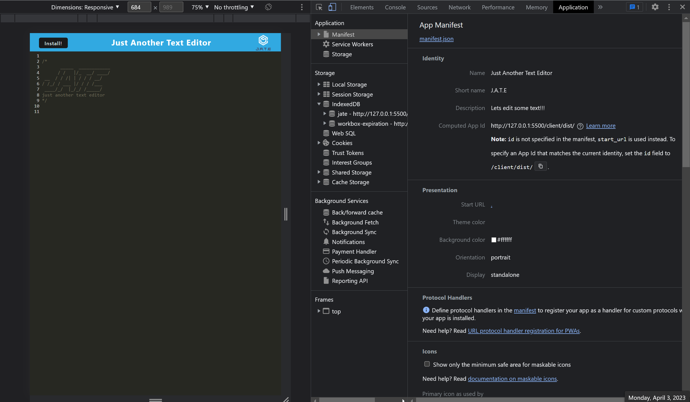
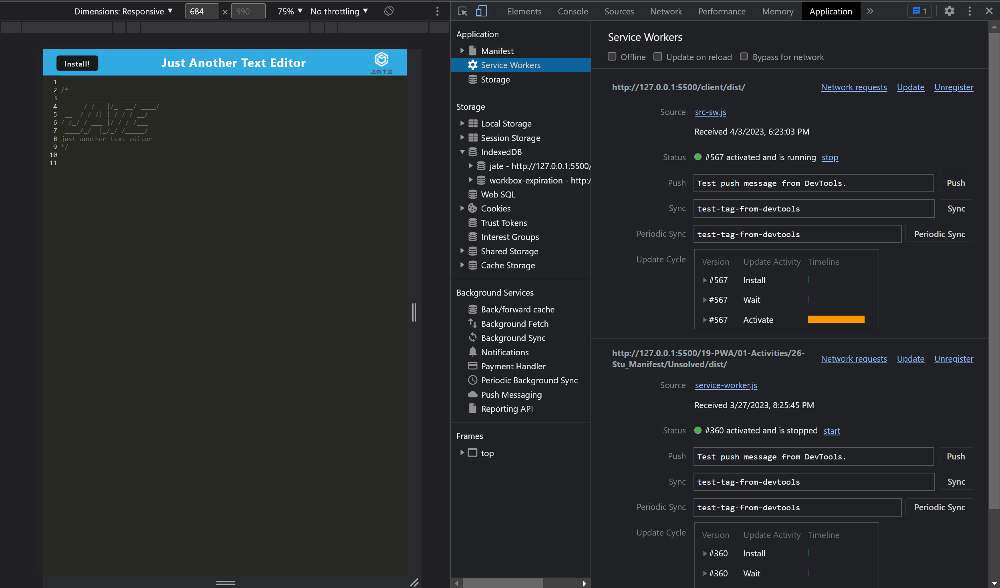
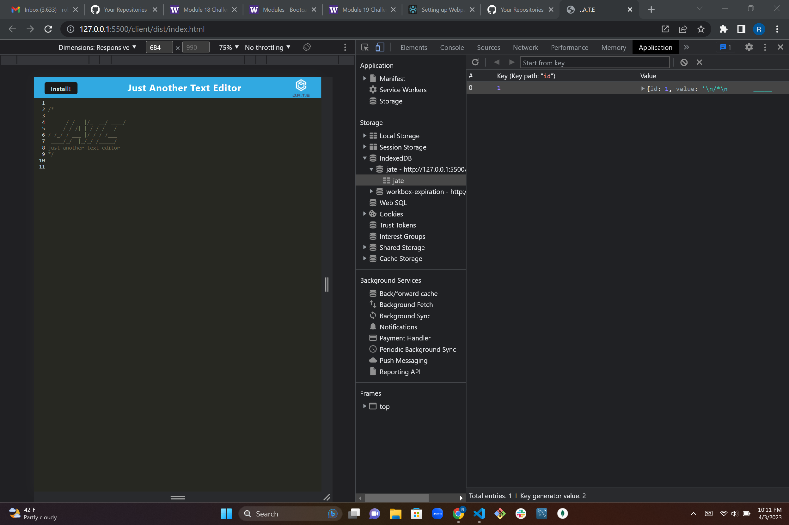

# text-editor-PWA

## Table of contents
​
- [Overview](#overview)
 - [The challenge](#the-challenge)
 - [Screenshot](#screenshot)
 - [Links](#links)
- [My process](#my-process)
 - [Built with](#built-with)
 - [What I learned](#what-i-learned)
 - [Continued development](#continued-development)
 - [Useful resources](#useful-resources)
- [Author](#author)
- [Acknowledgments](#acknowledgments)
​
## Overview
​
### The challenge
​
Users should be able to:
​
- Have a good understanding of Progressive Web Application and utilizing webpacks
- Configure webpacks via webpack.config.js to bundle assets and generate a index.HTML file via a dist folder
​
### Screenshot
​






​

### Links
​
- Solution URL: [Add solution URL here](https://your-solution-url.com)
- GitHub Repo: [Add live site URL here](https://your-live-site-url.com)
​
## My process
​
### Built with
​
- NPM packages
- Webpacks
- Javascript and HTML files
- Package.json dependancies and scripts

### What I learned
​
With the ever growing amount of files that we have to manage at the same time, small little mistake can snowball into big errors within the webpage console. One such instance was near the bottom of my database.js. Just a simple ? somehow was about to take a TA awhile to realize it was missing. Although it wasnt the main culprit to the overall error it stil distracted from finding the main culprit. 

  ```return result?.value;```

​
### Continued development
​
Adding a little flair and personalization would be nice, even thought it works fine now itd be nice to go above and beyond eventually.
​
### Useful resources
​
- [Example resource 1](https://www.example.com) - This helped me for XYZ reason. I really liked this pattern and will use it going forward.
- [Example resource 2](https://www.npmjs.com/package/webpack-pwa-manifest) - Used this to help construct the pwa manifest for webpack.config.js
- Class activities - Activities 19-27 and the mini-project helped out a lot when it came to configuring the webpack
​
## Author
 Robert
- GitHub - [appleschaussaa](https://github.com/appleschaussaa)
​
## Acknowledgments
​
For this week I really have to hand it to the TA Justin. He has come through a lot in the past but this time took most of office hours trying to track down a couple errors that were causing console errors and stopping it from running properly once on the server. Very thankful of that.
